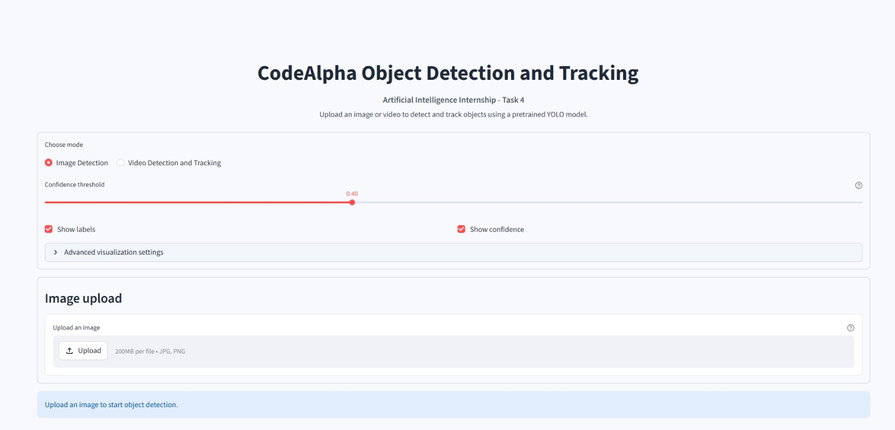
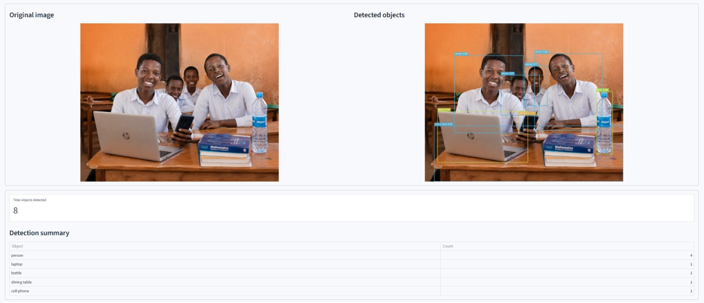
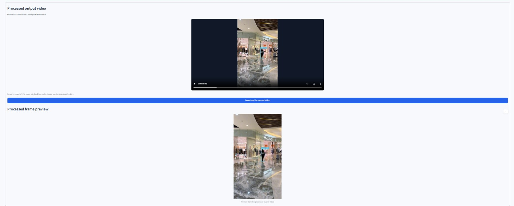
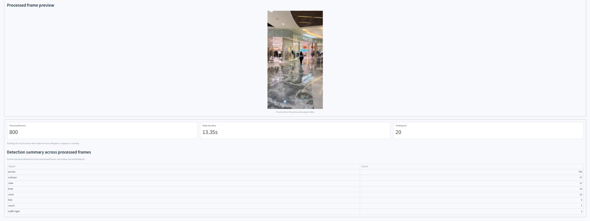

# CodeAlpha Object Detection and Tracking

## Internship Domain

Artificial Intelligence

## Task Name

Task 4 - Object Detection and Tracking

## Project Overview

This project is an object detection and tracking web application developed for the CodeAlpha Artificial Intelligence Internship.

The application allows users to upload an image or a short video and detect objects using a pretrained YOLO model. For images, the app displays detected objects with bounding boxes, class labels, and confidence scores. For videos, the app processes frames, detects objects, tracks them where possible, displays tracking IDs, and saves the processed output video.

This project uses a pretrained YOLO model. No custom model was trained.

## Project Objective

The main objective of this project is to build a simple and practical object detection and tracking system that can:

* Detect objects in uploaded images
* Detect and track objects in uploaded videos
* Draw bounding boxes around detected objects
* Display object labels and confidence scores
* Show tracking IDs in video mode
* Provide a clean Streamlit-based user interface
* Save and display processed video output
* Present clear detection summaries for images and videos

## Features

* Clean and professional Streamlit user interface
* Image upload support
* Video upload support
* Pretrained YOLO object detection
* Bounding boxes for detected objects
* Class labels for detected objects
* Confidence score display
* Adjustable confidence threshold
* Object tracking support for video processing
* Tracking ID display in video mode
* Original image and detected image preview
* Original video and processed video preview
* Processed frame preview for video output
* Detection summary table for images
* Detection summary across processed video frames
* Download button for processed video output
* Advanced visualization settings
* Friendly warnings and error handling
* No custom model training required

## Object Detection and Tracking Approach

This project uses a pretrained YOLO model from the Ultralytics library.

For image detection, the uploaded image is passed to the YOLO model. The model detects objects and returns bounding boxes, object class names, and confidence scores. The application then draws clean boxes and labels on the detected image and displays a summary of detected objects.

For video detection and tracking, the uploaded video is processed frame by frame using OpenCV. The YOLO model detects objects in each frame and tracks them where possible. The processed frames are written into a new output video file and saved inside the `outputs/` folder.

The video summary counts detections across processed frames. These counts do not represent unique real-world objects. For example, if the same person appears in many frames, that person may be counted multiple times across the video frames.

Tracking IDs may increase when objects move, disappear, reappear, overlap, or leave and re-enter the frame.

## Technologies Used

* Python
* Streamlit
* Ultralytics YOLO
* OpenCV
* NumPy
* Pillow

## Folder Structure

```text
CodeAlpha_Object_Detection_Tracking/
|
|-- app.py
|-- frontend.py
|-- detector.py
|-- video_processor.py
|-- visualization.py
|-- requirements.txt
|-- README.md
|-- .gitignore
|
|-- screenshots/
|   |-- home_page.png
|   |-- image_detection.png
|   |-- video_detection.png
|   `-- video_summary.png
|
|-- samples/
|   `-- .gitkeep
|
`-- outputs/
    `-- .gitkeep
```

## File Description

### app.py

Starts the Streamlit application by importing and running the main app function from `frontend.py`.

### frontend.py

Contains the Streamlit user interface, mode selection, upload sections, confidence threshold control, visualization settings, image output display, video output display, and summary sections.

### detector.py

Contains image detection logic using the pretrained YOLO model. It processes uploaded images, draws bounding boxes, labels, and confidence scores, then returns the detected image and summary data.

### video_processor.py

Contains video processing and tracking logic. It reads uploaded videos, processes frames using YOLO, draws object detection and tracking results, saves the processed video, and returns summary information.

### visualization.py

Contains helper functions for drawing clean bounding boxes, compact labels, stable class colors, and readable overlays.

### requirements.txt

Contains the required Python packages for running the project.

## Installation Steps

### 1. Clone the Repository

```bash
git clone https://github.com/abdinasir600s-a11y/CodeAlpha_Object_Detection_Tracking.git
```

### 2. Open the Project Folder

```bash
cd CodeAlpha_Object_Detection_Tracking
```

### 3. Create a Virtual Environment

```bash
py -m venv venv
```

If your system uses `python` instead of `py`, use:

```bash
python -m venv venv
```

### 4. Activate the Virtual Environment

For Windows:

```bash
venv\Scripts\activate
```

For macOS or Linux:

```bash
source venv/bin/activate
```

### 5. Install Required Packages

```bash
py -m pip install -r requirements.txt
```

If your system uses `python` instead of `py`, use:

```bash
python -m pip install -r requirements.txt
```

## Requirements

The project uses the following dependencies:

```text
streamlit
ultralytics
opencv-python
numpy
pillow
```

## How to Run the App

Run the Streamlit app using:

```bash
streamlit run app.py
```

If `streamlit` is not recognized, use:

```bash
py -m streamlit run app.py
```

or:

```bash
python -m streamlit run app.py
```

After running the command, open the local URL shown in the terminal. It is usually:

```text
http://localhost:8501
```

## How to Use Image Detection

1. Open the app in the browser.
2. Select `Image Detection`.
3. Adjust the confidence threshold if needed.
4. Upload an image in JPG or PNG format.
5. View the original image and detected image.
6. Check the total objects detected.
7. Review the detection summary table.

## How to Use Video Detection and Tracking

1. Open the app in the browser.
2. Select `Video Detection and Tracking`.
3. Adjust the confidence threshold if needed.
4. Upload a short video in MP4, AVI, or MOV format.
5. Click `Process Video`.
6. Wait while the app processes the video frames.
7. View the processed output video.
8. View the processed frame preview.
9. Check processed frames, video duration, and tracking IDs.
10. Review the detection summary across processed frames.
11. Download the processed video if needed.

## Screenshots

### Home Page



### Image Detection



### Video Detection



### Video Summary



## Demo Video

A demo video is recorded separately to show the working application, including image detection, video detection, object tracking, processed output video, and GitHub repository overview.

## GitHub Repository

```text
https://github.com/abdinasir600s-a11y/CodeAlpha_Object_Detection_Tracking
```

## Important Notes

* This project uses a pretrained YOLO model.
* No custom object detection model was trained.
* Short videos are recommended for faster processing.
* Detection accuracy may vary depending on image quality, lighting, object size, camera angle, and video resolution.
* Video detection summary counts detections across processed frames, not unique real-world objects.
* Tracking IDs may increase when objects move, disappear, reappear, overlap, or leave and re-enter the frame.
* If browser video playback has codec issues, use the download button to download and view the processed video.
* Source files are stored with real multiline formatting for clear GitHub RAW viewing.

## Limitations

* The app depends on a pretrained YOLO model, so it can only detect object classes supported by the model.
* Very small, blurry, dark, or hidden objects may not be detected correctly.
* Processing long videos may take more time.
* Tracking IDs may not always remain consistent in crowded or fast-moving scenes.
* The app is designed for internship demonstration and learning purposes, not for production surveillance or safety-critical use.

## Future Improvements

Possible future improvements include:

* Webcam-based real-time object detection
* Better object tracking with advanced tracking algorithms
* Custom model training for specific object categories
* Exporting detection reports as CSV
* Object filtering by selected class
* Better performance optimization for large videos

## Author

Name: Abdinasir Osman Warsame

Role: CodeAlpha Artificial Intelligence Intern

GitHub: abdinasir600s-a11y

## CodeAlpha Acknowledgement

This project was completed as part of the CodeAlpha Artificial Intelligence Internship.

Task: Task 4 - Object Detection and Tracking

## Disclaimer

This project is built for educational and internship purposes. It uses a pretrained YOLO model through the Ultralytics library. No custom model was trained, and no paid API is used. The results may not always be perfect, and detection accuracy depends on the quality and clarity of the uploaded image or video.
